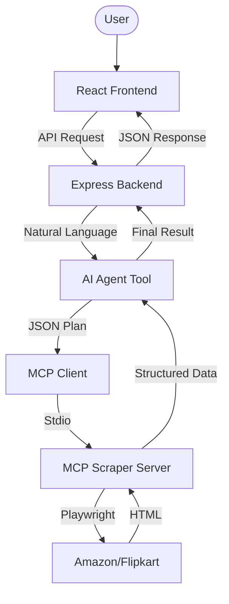

# Web Agent Product Price Browser

A powerful, AI-driven product price comparison and search tool that aggregates results from **Amazon.in** and **Flipkart.com**. It uses the **Model Context Protocol (MCP)** to bridge an AI agent with real-time web scraping capabilities.

---

## 🚀 Key Features

-   **Multi-Platform Search**: Simultaneously search for products on Amazon and Flipkart.
-   **AI Agent Intelligence**: Uses an LLM (via Groq) to plan and execute searches based on natural language queries.
-   **Best Deal Heuristics**: Automatically calculates "Deal Scores" based on discount percentages and ratings to highlight the best offers.
-   **Product Comparison**: AI-powered comparison of technical specifications and features for multiple products.
-   **Dynamic Result Limiting**: Intelligent limiting of results (e.g., top 3 for "best" queries) to reduce noise.
-   **Technical Depth**: Deep scraping of product highlights and descriptions for selected items.

---

## 🛠️ Technologies Used

### Frontend
-   **React 19**: Modern UI framework.
-   **TypeScript**: Type-safe development.
-   **Vite**: Lightning-fast build tool and dev server.
-   **Tailwind CSS 4**: Next-gen utility-first CSS for premium styling.
-   **Radix UI**: Accessible, unstyled primitives for UI components.
-   **Axios**: For API communication with the backend.

### Backend & AI
-   **Node.js & Express**: Robust server-side framework.
-   **Model Context Protocol (MCP)**: Standardized protocol for AI tool integration.
-   **Playwright**: Headless browser automation for high-fidelity web scraping.
-   **Groq SDK**: High-performance LLM inference for the AI agent (using GPT-style models).
-   **Zod**: Schema validation for tool inputs and API requests.

---

## 📐 Architecture: How it Works

The application follows a modular architecture where the frontend communicates with a central Express server, which in turn orchestrates an AI agent and a specialized MCP scraping server.



### The MCP Integration
1.  **Frontend** sends a query like "Find me the best wireless gaming mouse under 5k".
2.  **Backend** invokes the `agentTool`, which uses an LLM to translate the query into a sequence of tool calls.
3.  **Agent** acts as an **MCP Client**. It spawns the `fetchServer.ts` (the **MCP Server**) as a subprocess using `StdioClientTransport`.
4.  **MCP Server** exposes tools like `product-scraper` and `product-details`.
5.  **Agent** calls these tools via the MCP protocol. The server uses **Playwright** to navigate, wait for dynamic content, and parse the DOM.
6.  **Results** are returned through the protocol, post-processed by the Agent (scoring deals, sorting), and sent back to the UI.

---

## 🚦 Getting Started

### Prerequisites
-   Node.js (v18+)
-   NPM or Yarn
-   Groq API Key (Set in `backend/.env`)

### Installation

1.  **Clone the repository**:
    ```bash
    git clone <repo-url>
    cd web-agent-product-price
    ```

2.  **Setup Backend**:
    ```bash
    cd backend
    npm install
    cp .env.example .env # Add your GROQ_API_KEY
    ```

3.  **Setup Frontend**:
    ```bash
    cd ../frontend
    npm install
    ```

### Running the App

1.  **Start the Backend**:
    ```bash
    cd backend
    npm run start
    ```

2.  **Start the Frontend**:
    ```bash
    cd frontend
    npm run dev
    ```

---

## 📁 Project Structure

```text
├── backend/
│   ├── src/tools/
│   │   ├── fetchServer.ts    # The MCP Server (Playwright Logic)
│   │   └── agentTool.ts      # The AI Agent (MCP Client + LLM)
│   ├── routes/               # Express API Routes
│   └── server.ts             # Entry point
├── frontend/
│   ├── src/
│   │   ├── components/       # UI Components (Product Cards, etc.)
│   │   └── App.tsx           # Main Logic
│   └── package.json
└── README.md                 # Project Overview
```

---

## 📝 License
ISC License.
